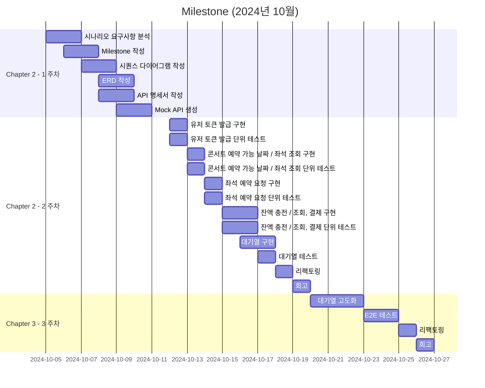

# Milestone

---

```mermaid
gantt
    title Milestone (2024년 10월)

    section Chapter 2 - 1 주차
    시나리오 요구사항 분석: 2024-10-05, 2d
    Milestone 작성: 2024-10-06, 2d
    시퀀스 다이어그램 작성: 2024-10-07, 2d
    ERD 작성: 2024-10-08, 2d
    API 명세서 작성: 2024-10-08, 2d
    Mock API 생성: 2024-10-09, 2d

    section Chapter 2 - 2 주차
    유저 토큰 발급 구현: 2024-10-12, 1d
    유저 토큰 발급 단위 테스트: 2024-10-12, 1d
    콘서트 예약 가능 날짜 / 좌석 조회 구현: 2024-10-13, 1d
    콘서트 예약 가능 날짜 / 좌석 조회 단위 테스트: 2024-10-13, 1d
    좌석 예약 요청 구현: 2024-10-14, 1d
    좌석 예약 요청 단위 테스트: 2024-10-14, 1d
    잔액 충전 / 조회, 결제 구현: 2024-10-15, 2d
    잔액 충전 / 조회, 결제 단위 테스트: 2024-10-15, 2d
    대기열 구현: 2024-10-16, 2d
    대기열 테스트: 2024-10-17, 1d
    리팩토링: 2024-10-18, 1d
    회고: 2024-10-19, 1d

    section Chapter 3 - 3 주차
    대기열 고도화: 2024-10-20, 3d
    E2E 테스트: 2024-10-23, 2d
    리팩토링: 2024-10-25, 1d
    회고: 2024-10-26, 1d
```